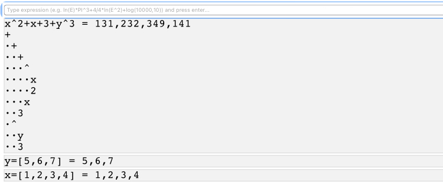

# ExpressionParser.js
Recursive descent parser for math expressions

Support for variables, lists, and vectorized expressions (i.e., with lists): 
x=[1,2,3,4] 
y=[5,6,7] 
x^2+x+3+y^3

Demo: http://niclasko.github.io/ExpressionParser
